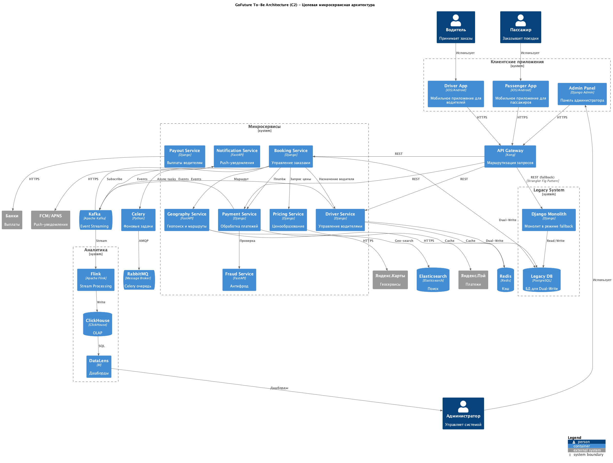

# Задание 1: Проектирование доменов GoFuture

## 1. Список нефункциональных требований

1. Обработка 500 тысяч конкурентных поездок
2. Доступность критических сервисов 99.95%
3. Latency API менее 100ms
4. Zero-downtime развёртывание новых версий
5. Автоматическое горизонтальное масштабирование в 3+ регионах
6. Изоляция отказов через Circuit Breaker
7. Централизованный мониторинг и алертинг
8. PCI DSS compliance для платёжных сервисов
9. Eventual consistency для некритичных операций
10. Постепенная миграция без остановки бизнеса

---

## 2. Диаграмма С2 сервисов To-Be с механизмом обеспечения обратной совместимости

### Механизмы обратной совместимости

**Strangler Fig Pattern**  
API Gateway постепенно переключает трафик с монолита на микросервисы. Если новый сервис упал или глючит, запросы автоматически идут в монолит.

**Dual-Write**  
Во время миграции пишем данные параллельно в две базы - новую и старую. Если что-то пойдет не так, можем быстро откатиться на монолит без потери данных.

**Event-Driven**  
Kafka для событий между сервисами. Когда происходит что-то важное (создали заказ, оплатили), сервис кидает событие в Kafka, а остальные подписываются на то что им нужно. Для фоновых задач используем RabbitMQ + Celery.

---

## 3. Очерёдность выделения сервисов

**1. Geography Service**  
С него начинаем, потому что самый простой. Геопоиск водителей и построение маршрутов - довольно изолированная штука.

**2. Notification Service**  
Уведомления. Если они упадут, основной бизнес работает дальше. Просто слушает Kafka и шлет пуши.

**3. Pricing Service**  
Цены меняются часто - то акции, то surge pricing. Чтобы каждый раз не деплоить весь монолит, лучше вынести отдельно.

**4. Driver Service**  
Водители и все что с ними связано. Делаем после Geography чтобы сразу связать с геопоиском.

**5. Payments Service**  
Платежи это критично, по требованиям PCI DSS должны быть изолированы. Тут миграция будет осторожная, с тщательным тестированием.

**6. Payouts Service**  
Выплаты водителям. Зависит от Driver Service (нужны банковские данные), поэтому идет после него.

**7. Booking Service**  
Самый сложный, потому что связывает все остальное - цены, водителей, платежи. Делаем в конце когда все остальные сервисы уже работают.

**8. Fraud Service**  
Антифрод. Работает асинхронно, не блокирует операции пользователя. Можем выделить когда угодно, не критично.

**9. Analytics Service**  
Аналитика. В самом конце, потому что не влияет на основной бизнес.

---

## 4. План миграции

### Подготовка инфраструктуры

Сначала поднимаем всю инфраструктуру:
- Docker для контейнеризации
- Kafka для событий
- RabbitMQ для очередей
- Redis для кеша
- Elasticsearch для поиска
- Kong как API Gateway (пока весь трафик идет в монолит)
- Мониторинг: Prometheus, Grafana, Loki
- Jenkins для CI/CD

### Миграция сервиса (общие шаги)

1. Создаем новую PostgreSQL базу для сервиса
2. Пишем сам сервис на Django или FastAPI
3. Переносим данные из монолита
4. Включаем Dual-Write - теперь пишем и в старую и в новую базу
5. Подключаем к Kafka чтобы слушать/публиковать события
6. Настраиваем Kong чтобы часть запросов шла в новый сервис
7. Смотрим метрики, сравниваем с монолитом
8. Постепенно переводим весь трафик на новый сервис
9. Если все ок - выключаем Dual-Write
10. Удаляем старый код из монолита

### Особенности для разных сервисов

Geography и Notification достаточно простые, для них можно обойтись без Dual-Write - просто переключаем трафик.

Payments и Payouts это финансы, тут тестируем по полной программе. Сначала запускаем в production на небольшом проценте трафика, потом постепенно увеличиваем.

Booking делаем самым последним, он зависит от всех остальных сервисов.

### Завершение миграции

Когда все сервисы работают:
- Отключаем маршруты к монолиту в API Gateway
- Выключаем Dual-Write везде где он остался
- Архивируем старую базу данных
- Можем оставить монолит как fallback еще на какое-то время для подстраховки
