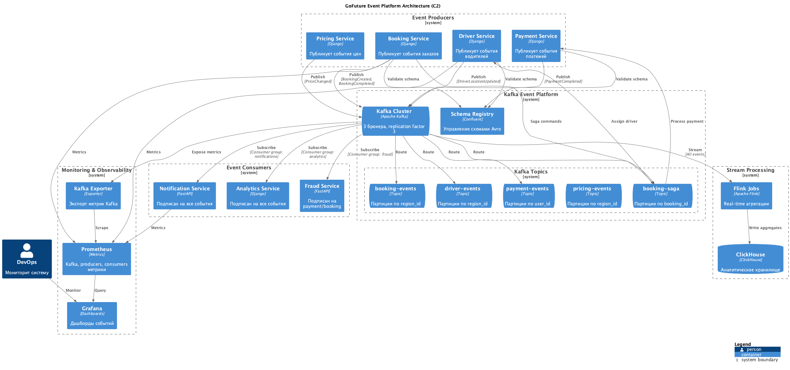

# Задание 2: Архитектура событийной платформы GoFuture

## Диаграмма C2 событийной платформы

---

## 1. Доменные события

Разбили события по доменам:

**Booking**
- BookingCreated, BookingAccepted, BookingStarted, BookingCompleted, BookingCancelled

**Driver** 
- DriverLocationUpdated (каждые 5 сек с GPS)
- DriverStatusChanged (online/offline/busy)
- DriverRated

**Payment**
- PaymentInitiated, PaymentCompleted, PaymentFailed, PaymentRefunded

**Pricing**
- PriceCalculated, SurgePricingActivated, PromotionApplied

---

## 2. Топики Kafka и партиционирование

### Основные топики

**booking-events** - 12 партиций по region_id, хранение 7 дней

**driver-events** - 24 партиции (много GPS данных), хранение 3 дня, компрессия включена

**payment-events** - 6 партиций по user_id (чтобы все платежи пользователя шли в порядке), хранение 30 дней

**pricing-events** - 12 партиций по region_id, хранение 7 дней

**booking-saga** - 6 партиций по booking_id для координации распределенных транзакций

### Зачем партиционирование по регионам

Партиционирование по `region_id` удобно:
- События одного региона в одной партиции
- Можно масштабировать по регионам независимо
- Региональная аналитика проще
- Меньше задержек

Все топики с replication factor 3 для надежности.

---

## 3. Обработка событий

### Consumer Groups

**notifications-group** - читает все топики, отправляет пуши

**analytics-group** - тоже все топики, пишет в ClickHouse через Analytics Service, может немного отставать

**fraud-group** - только payment и booking события, должен работать быстро

### RabbitMQ + Celery

Для фоновых задач (не event-driven) используем RabbitMQ + Celery:
- Генерация отчетов
- Массовые рассылки
- Периодические задачи (cron jobs)
- Долгие асинхронные операции

Kafka для событий, RabbitMQ для задач - это два разных паттерна.

### Flink для real-time

Используем Flink для агрегаций на лету:
- Считаем поездки по регионам за 5 минут (для surge pricing)
- Среднюю цену
- Процент отмен
- Ищем аномальное поведение (резкие скачки локации водителя, странные паттерны платежей)

### Analytics Service

Analytics Service (из Task1) работает как:
- **API** - для запросов к аналитике (REST endpoints)
- **Consumer** - читает события из Kafka и пишет в ClickHouse
- **Wrapper** над ClickHouse - скрывает детали хранения от других сервисов

Flink работает параллельно для real-time агрегаций, результаты тоже пишутся в ClickHouse.

---

## 4. Saga Pattern

Выбрали **Choreography Saga** - каждый сервис сам знает на какие события реагировать, без центрального orchestrator.

### Пример: создание заказа

**Если все ок:**
1. Booking создает BookingCreated
2. Pricing считает цену, публикует PriceCalculated
3. Driver назначает водителя, публикует DriverAssigned
4. Payment обрабатывает платеж, публикует PaymentCompleted
5. Booking меняет статус на Confirmed

**Если платеж упал:**
1. Payment публикует PaymentFailed
2. Booking публикует BookingCancelled
3. Driver освобождает водителя
4. Notification шлет пуш пользователю

Для саги используем отдельный топик `booking-saga` где храним события: SagaStarted, SagaStepCompleted, SagaFailed, SagaCompleted.

---

## 5. Надежная доставка

### At-least-once

Настраиваем Kafka на at-least-once:
- Producer с `acks=all` - ждем подтверждения от всех реплик
- Retry при ошибках
- Consumer коммитит offset только после обработки

### Idempotency

Можем получить дубликат события, поэтому:
- В базе храним event_id и проверяем перед обработкой
- Используем transactional outbox - событие и данные пишем атомарно

### Schema Registry

Все схемы событий в Avro валидируются через Schema Registry. Если кто-то попробует отправить кривое событие - сразу ошибка.

---

## 6. Мониторинг

Мониторим на трех уровнях:

### Kafka Cluster
- Состояние брокеров (живы или нет)
- Партиции без реплик (критично)
- Latency и throughput

### Producers/Consumers
- Сколько событий отправляем/читаем в секунду
- Ошибки при отправке
- **Consumer lag** (отставание) - самое важное! Если растет значит не успеваем обрабатывать

### Business метрики
- Сколько заказов создано
- Процент завершенных заказов
- Успешность платежей
- Как часто саги падают

---

## 7. Инструменты мониторинга

**Prometheus** - собирает метрики со всех сервисов и Kafka (через Kafka Exporter)

**Grafana** - дашборды:
- Здоровье Kafka кластера
- Consumer lag по группам
- Бизнес-метрики

**Alertmanager** - алерты если:
- Consumer lag больше 10k сообщений
- Партиции потеряли реплики
- Много ошибок в producer
- Саги часто падают
- Брокер упал

Шлет в Telegram и на email.

**Loki** (опционально) - собираем логи, чтобы можно было trace-ить событие по всем сервисам.
