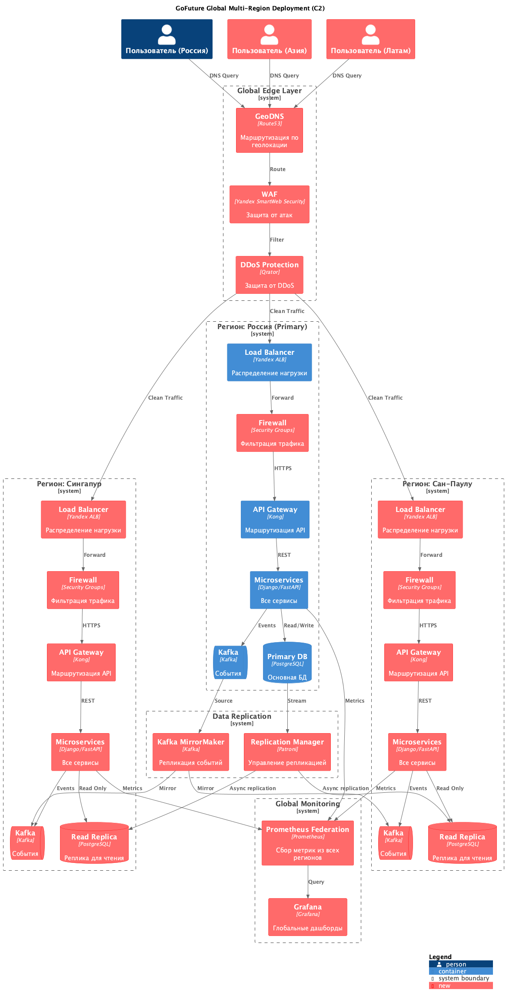
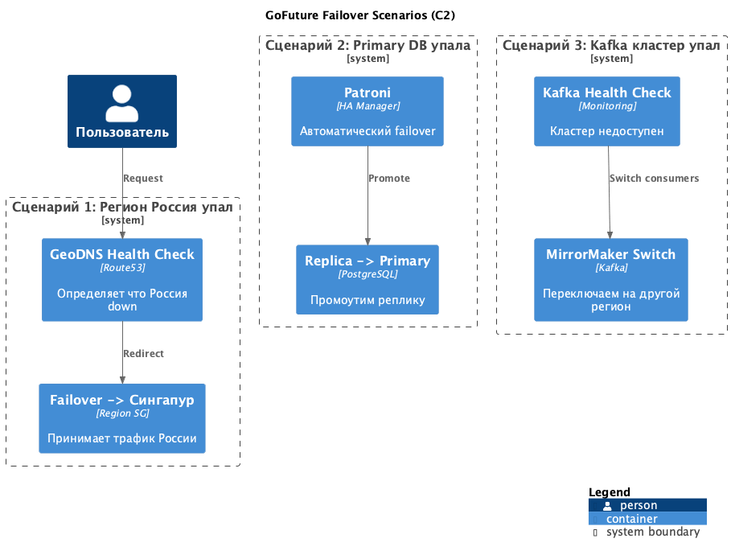

# Задание 3: Глобальное развертывание GoFuture

## Диаграмма C2 глобального развертывания

Новые элементы выделены красным цветом.

---

## 1. Выбор регионов развертывания

### Выбранные регионы

**Россия (Москва) - Primary**
- Основной регион, тут primary база данных
- Большинство пользователей из России

**Сингапур - Secondary** 
- Для Юго-Восточной Азии
- Низкая latency для Индонезии, Таиланда, Малайзии
- Сингапур - Yandex Cloud хаб в регионе

**Сан-Паулу (Бразилия) - Secondary**
- Для Южной Америки
- Основные рынки: Бразилия, Аргентина, Чили
- Сан-Паулу - единственный толковый дата-центр в регионе

### Почему эти регионы

**Latency**
- Пользователи в Азии сейчас получают ~200-300ms до России
- С регионом в Сингапуре latency падает до ~50ms
- Аналогично для Латинской Америки

**Compliance**
- В разных странах разные требования к хранению данных
- Локальные регионы помогают соблюдать LGPD (Бразилия), PDPA (Сингапур)

**Availability**
- 99.99% доступности = ~52 минуты downtime в год
- С тремя регионами можем это обеспечить

---

## 2. Схема репликации данных

### PostgreSQL репликация

**Async Streaming Replication**
- Primary в России стримит изменения в реплики (Сингапур, Сан-Паулу)
- Используем Patroni для автоматического failover
- Lag обычно 1-5 секунд

**Read Replicas**
- Сингапур и Сан-Паулу работают в read-only режиме
- Все writes идут в primary (Россия)
- Reads можно делать локально

**Почему не Multi-Master**
- Слишком сложно для начала
- Конфликты записей - головная боль
- Async replication проще и надежнее

### Kafka репликация

**Kafka MirrorMaker 2.0**
- Реплицирует события из России в Сингапур и Сан-Паулу
- Работает асинхронно
- Если Россия упадет, события все равно есть в других регионах

**Topics replication**
- Реплицируем критичные топики: booking-events, payment-events
- driver-events не реплицируем (GPS данные быстро устаревают)

---

## 3. Геомаршрутизация

### DNS-based routing (Route53 / Yandex DNS)

**Как работает:**
1. Пользователь делает DNS запрос (api.gofuture.com)
2. GeoDNS смотрит откуда запрос (по IP определяет страну)
3. Возвращает IP ближайшего региона:
   - Россия/Европа -> регион Россия
   - Азия -> регион Сингапур
   - Латам -> регион Сан-Паулу

**Health Checks**
- GeoDNS проверяет здоровье регионов каждые 30 секунд
- Если регион не отвечает - редиректит на другой

### Защита на Edge

**DDoS Protection (Qrator / Yandex)**
- Фильтрует DDoS атаки до того как трафик дойдет до наших серверов
- Scrubbing centers в разных странах

**WAF (Web Application Firewall)**
- Защита от SQL injection, XSS и других атак
- Используем Yandex SmartWeb Security

**Firewall на региональном уровне**
- Security Groups фильтруют трафик между компонентами
- Только разрешенные порты и протоколы

---

## 4. Аварийное переключение (Failover)

### Сценарии отказа

| Сценарий | Точка отказа | Механизм failover | RTO | RPO |
|----------|--------------|-------------------|-----|-----|
| 1. Регион упал | Весь регион Россия | GeoDNS переключает на Сингапур | 2-5 мин | 5-10 сек |
| 2. Primary DB упала | PostgreSQL Primary | Patroni промоутит реплику | 30-60 сек | 5 сек |
| 3. Kafka кластер упал | Kafka Россия | Consumers переключаются на Kafka Сингапур | 1-2 мин | 0 (есть в репликах) |
| 4. API Gateway упал | Kong instance | Load Balancer переключает на другой instance | 10 сек | 0 |
| 5. Микросервис упал | Service instance | Load Balancer переключает на другой instance | 10 сек | 0 |

### Сценарий 1: Регион Россия упал

**Что происходит:**
1. Health checks GeoDNS не получают ответ от региона Россия
2. GeoDNS автоматически переключает DNS на Сингапур
3. Трафик из всех стран идет в Сингапур
4. Сингапур промоутит свою read replica в primary (через Patroni)

**Проблемы:**
- Сингапур может не потянуть весь мировой трафик
- Нужно быстро скейлиться

**Решение:**
- Auto-scaling в Сингапуре на основе CPU/Memory
- Заранее держим capacity для x2 нагрузки

### Сценарий 2: Primary DB упала

**Patroni automatic failover:**
1. Patroni определяет что primary не отвечает (health check каждые 10 сек)
2. Patroni промоутит одну из реплик в primary
3. Обновляет endpoint в etcd/consul
4. Сервисы автоматически подключаются к новому primary

**Время:** 30-60 секунд

### Сценарий 3: Kafka упал

**MirrorMaker switch:**
1. Health check определяет что Kafka в России недоступен
2. Consumers автоматически переключаются на Kafka в Сингапуре
3. События продолжают обрабатываться (они уже смирорены)

**Важно:**
- Producers должны ретраить или писать в локальный Kafka
- Можем временно потерять новые события (если Россия полностью недоступна)

---

## 5. Инструменты защиты (Security)

### Edge Layer

**DDoS Protection**
- Qrator или Yandex DDoS Protection
- Фильтрация вредоносного трафика
- Scrubbing на уровне сети

**WAF (Web Application Firewall)**
- Yandex SmartWeb Security или Cloudflare
- Защита от OWASP Top 10
- Rate limiting

### Network Layer

**Security Groups / Firewall**
- Фильтрация трафика между компонентами
- Правила: только нужные порты открыты
- Разделение на зоны (DMZ, private subnets)

**VPC Peering**
- Регионы связаны через private network
- Реплика данных идет не через интернет

---

## 6. Стратегия комплаенса (Compliance)

### GDPR (Европа / Россия)

**Требование:** Данные граждан ЕС должны храниться в ЕС

**Решение:**
- Регион Россия подходит для России
- Для ЕС можем добавить отдельный регион Франкфурт в будущем
- Пока российские пользователи = регион Россия

### LGPD (Бразилия)

**Требование:** Данные бразильцев должны храниться в Бразилии или с согласия могут передаваться

**Решение:**
- Регион Сан-Паулу хранит реплику данных
- Все writes идут через Бразилию, reads локальные
- В Terms of Service прописываем что данные могут храниться в других регионах

### PDPA (Сингапур)

**Требование:** Данные должны быть защищены, могут храниться где угодно с согласия

**Решение:**
- Регион Сингапур хранит реплику
- Шифрование at rest и in transit
- Согласие в Terms of Service

### PCI DSS (Платежи)

**Требование:** Платежные данные должны быть изолированы

**Решение:**
- Payment Service изолирован
- Не храним card data (только tokens от Яндекс.Пэй)
- Логи payment service не смешиваются с другими

### Data Residency

Если какая-то страна потребует чтобы данные НЕ покидали страну:
- Можем отключить репликацию для этой страны
- Данные будут только в локальном регионе
- Но тогда failover не сработает (риск)
