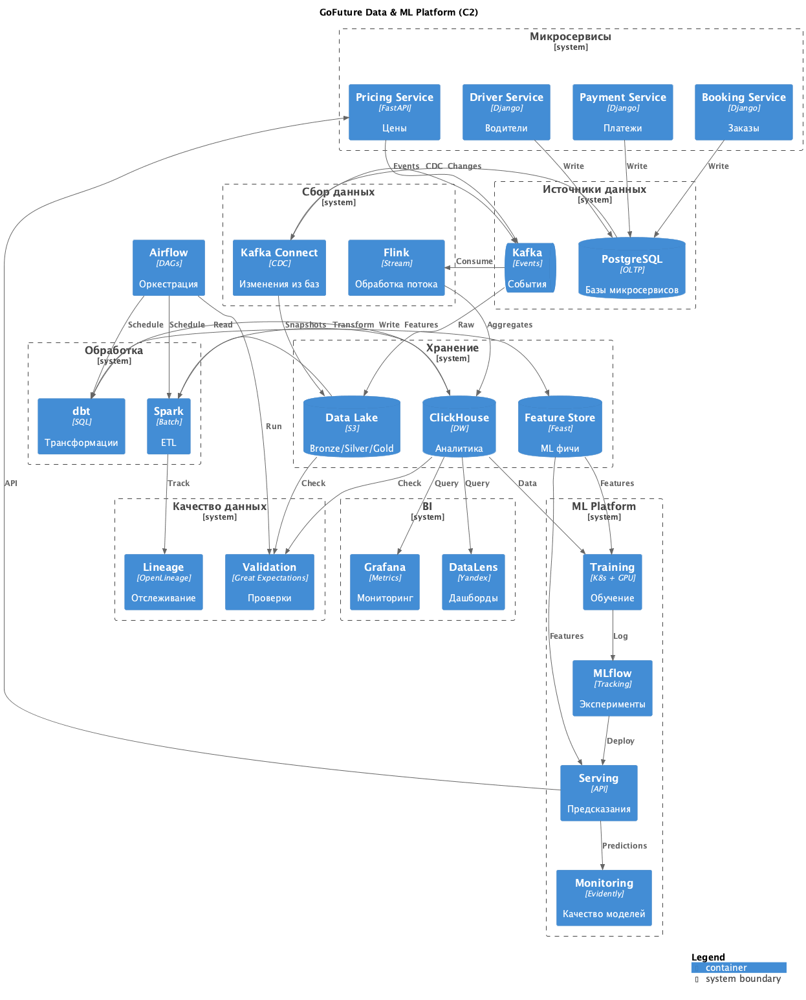

# Задание 4: Data & ML Platform для GoFuture

## Диаграмма C2 Data & ML Platform

---

## 1. Источники данных

**Микросервисы из Task1:**
- Booking, Driver, Payment, Pricing, Fraud
- У каждого своя PostgreSQL база
- События публикуются в Kafka

---

## 2. Сбор данных (Data Ingestion)

### Kafka Connect + Debezium

Используем CDC (Change Data Capture) для автоматического сбора изменений из баз:
- Все изменения в PostgreSQL автоматически попадают в Kafka
- Не надо менять код микросервисов
- Ничего не теряется

### Flink для обработки потока

Real-time обработка событий:
- Фильтруем невалидные данные
- Считаем простые агрегаты (сколько поездок за час)
- Пишем результаты в ClickHouse

---

## 3. Хранение данных (Data Storage)

### Data Lake (S3)

Храним данные слоями:

**Bronze** - сырые данные как есть из Kafka

**Silver** - почистили от дубликатов, поправили ошибки

**Gold** - готовые агрегаты для ML и BI

### ClickHouse

Аналитическая база для быстрых запросов:
- Таблица поездок
- Таблица платежей
- Агрегаты по часам/дням

### Feature Store (Feast)

Храним фичи для ML моделей:
- Средний рейтинг водителя за неделю
- Сколько поездок сделал пользователь за месяц
- Спрос в регионе за последний час

---

## 4. Обработка данных (Data Processing)

### Spark

Для больших batch-операций:
- ETL пайплайны
- Подготовка данных для обучения моделей
- Генерация фич

### dbt

Для SQL-трансформаций:
- Пишем трансформации как SQL в Git
- Можем откатить если что-то сломалось
- Автоматически тестирует данные

---

## 5. ML Platform

### Use Cases

**Динамическое ценообразование**
- Модель предсказывает коэффициент surge pricing (1.0 - 3.0)
- Учитывает спрос, время суток, погоду
- Переобучаем раз в день

**Прогноз спроса**
- Предсказываем сколько будет поездок в следующий час
- Помогает заранее привлечь водителей
- Переобучаем раз в неделю

**Обнаружение фрода**
- Ищем подозрительные паттерны (фейковые поездки, отмывание денег)
- Возвращает fraud score от 0 до 1
- Обучается в онлайн режиме

### MLflow

Трекинг экспериментов:
- Сохраняем все эксперименты с моделями
- Версионируем модели
- Staging → Production

### Training

Кластер для обучения:
- Kubernetes с GPU
- Запускаем обучение по расписанию или вручную

### Serving

API для предсказаний:
- Pricing Service вызывает `/predict/surge_pricing`
- Fraud Service вызывает `/predict/fraud_score`
- Latency < 100ms

### Мониторинг моделей

Следим что модель не деградировала:
- Качество предсказаний
- Если что-то не так - алерт

---

## 6. BI и аналитика

### DataLens

Дашборды для бизнеса:
- Выручка по дням
- Сколько поездок
- География спроса
- Статистика по водителям

### Grafana

Технические метрики:
- Сколько данных обрабатывается
- Задержки в Kafka
- Ошибки в пайплайнах

---

## 7. Оркестрация (Airflow)

Управляем всеми пайплайнами через Airflow DAG'и:

**Ежедневный ETL:**
1. Проверяем данные
2. Запускаем Spark
3. Делаем трансформации через dbt
4. Обновляем Feature Store

**Переобучение моделей:**
1. Генерируем новые фичи
2. Обучаем модель
3. Тестируем
4. Деплоим если все ок

---

## 8. Качество данных

### Валидация

Проверяем данные на каждом этапе:
- Нет ли пустых полей где не должно быть
- Корректные ли типы данных
- Бизнес-правила (цена > 0, рейтинг от 1 до 5)

Если критичная ошибка - останавливаем пайплайн и шлем алерт.

### Data Lineage

Отслеживаем откуда какие данные:
- Если поменяем схему в одном месте, видим что сломается
- Помогает дебажить проблемы

### Идемпотентность

Можем запустить пайплайн несколько раз - результат будет одинаковый.
Используем партиционирование по дате и `INSERT OVERWRITE`.
