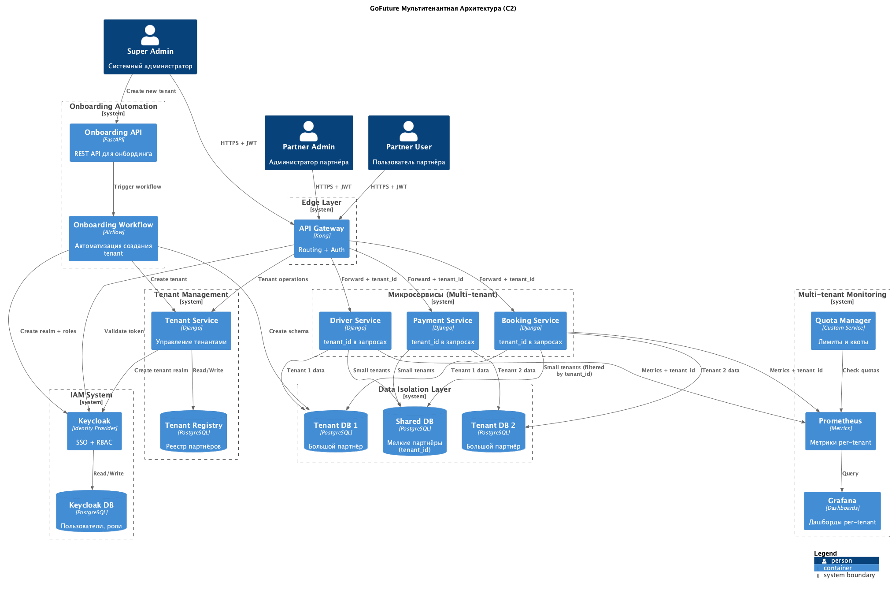
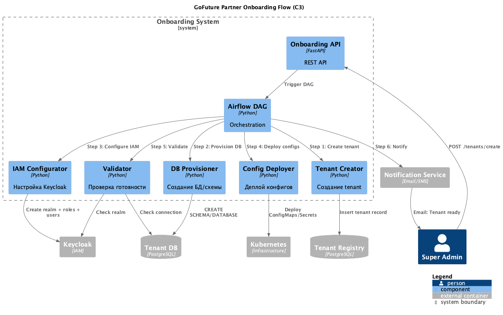

# Задание 5: Мультитенантная платформа GoFuture

## Диаграмма C2 мультитенантной архитектуры

## Диаграмма C3 процесса онбординга партнёра

---

## 1. Модель изоляции данных

### Гибридный подход

**Dedicated Database** - для крупных партнёров:
- Отдельная база или схема
- Полная изоляция данных
- Примеры: федеральные сети такси, крупные корпоративные клиенты

**Shared Database** - для мелких партнёров:
- Общая база с полем `tenant_id`
- Изоляция через фильтрацию по tenant_id
- Экономия ресурсов

### Выбор модели

**Dedicated для:**
- Объём данных > 100 GB
- Специфичные требования к производительности
- Регуляторные требования

**Shared для:**
- Объём данных < 100 GB
- Стандартные требования
- Экономия важнее изоляции

---

## 2. IAM система

### Keycloak (SSO + RBAC)

- Realm per tenant (изоляция пользователей)
- Single Sign-On через OAuth 2.0
- JWT токен содержит: `user_id`, `tenant_id`, `roles`
- Kong проверяет токен и передаёт `tenant_id` в сервисы

### Таблица ролей и доступов

| Роль | Описание | Доступ к данным | Разрешённые операции |
|------|----------|-----------------|---------------------|
| **Super Admin** | Системный администратор GoFuture | Все тенанты | - Создание/удаление тенантов - Управление квотами - Системные настройки |
| **Partner Admin** | Администратор партнёра | Свой тенант | - Управление пользователями - Настройка тарифов - Просмотр аналитики - Кастомизация UI |
| **Partner Operator** | Оператор поддержки | Свой тенант (ограниченный) | - Просмотр заказов - Отмена заказов - Возвраты - Поддержка водителей |
| **Partner Analyst** | Аналитик партнёра | Свой тенант (только чтение) | - Просмотр дашбордов - Экспорт отчётов - Аналитика по поездкам |
| **Driver** | Водитель | Свои данные | - Просмотр своих заказов - Обновление статуса - Просмотр выплат |
| **Rider** | Пассажир | Свои данные | - Создание заказа - Просмотр поездок - Оплата - Оценка водителя |

---

## 3. Автоматизированный onboarding

### Процесс создания нового партнёра (Airflow)

**Шаг 1: Создание tenant**
- Генерируем `tenant_id`
- Записываем в реестр партнёров
- Выбираем модель изоляции (dedicated/shared)

**Шаг 2: Provisioning БД**
- Dedicated: создаём отдельную схему/базу
- Shared: используем существующую

**Шаг 3: Применение миграций**
- Создаём таблицы в новой схеме

**Шаг 4: Настройка IAM**
- Создаём realm в Keycloak
- Создаём роли для партнёра
- Создаём первого пользователя (Partner Admin)

**Шаг 5: Деплой конфигов**
- Настраиваем маршруты в Kong
- Устанавливаем квоты

**Шаг 6: Валидация**
- Проверяем подключение к БД
- Делаем тестовый API call

**Шаг 7: Уведомление**
- Отправляем credentials партнёру
- Ссылка на портал администратора

---

## 4. Мониторинг мультитенантного окружения

### Метрики per-tenant (Prometheus)

- Requests per second
- Error rate
- Response time
- DB connections
- Storage usage
- Quota consumption

### Дашборды (Grafana)

**Global dashboard:**
- Топ-10 тенантов по нагрузке
- Общее количество requests
- Alerts по всем тенантам

**Per-tenant dashboard:**
- Метрики конкретного партнёра
- Доступен через SSO Partner Admin

### Квоты и лимиты

**Quota Manager** проверяет лимиты перед запросом:

| Quota Type | Basic Plan | Premium Plan |
|------------|------------|--------------|
| Requests/min | 1000 | 10000 |
| DB Storage | 50 GB | 500 GB |
| Users | 100 | Unlimited |
| API calls/day | 100k | 1M |

При превышении → HTTP 429 (Too Many Requests)

### Алерты

**Per-tenant:**
- Quota > 80% → предупреждение партнёру
- Error rate > 5% → алерт в поддержку

**System-wide:**
- Shared DB перегружена
- Keycloak недоступен
- Onboarding failed

---

## 5. Кастомизация для партнёров

### Уровни кастомизации

**UI/Branding:**
- Логотип и цвета партнёра
- Поддомен (citytaxi.gofuture.ru)

**Бизнес-логика:**
- Кастомные тарифы
- Surge pricing параметры
- Комиссия платформы

**Интеграции:**
- Webhook для событий
- Custom payment gateway

### Feature Flags

Хранятся в реестре партнёров:
- surge_pricing: вкл/выкл
- driver_rating: вкл/выкл
- promo_codes: вкл/выкл
